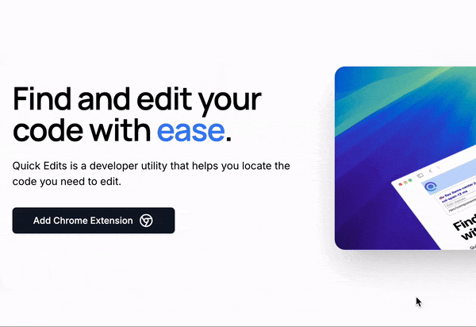

# Quick Edits

Quickly locates the code you need to edit. Optimizes the frontend development workflow.

## Usage


## Installation

### Chrome Extension
Install and build Chrome Extension.

```bash
  cd browser-extension
  npm install --legacy-peer-deps
  npm run build
```

### Native Code Search Module
```bash
  cd native-module
  go install
  go build
```

#### MacOS Config
```bash
  cd /Library/Google/Chrome/NativeMessagingHosts
  sudo touch com.my_company.my_application.json
```

Add this as content of `com.my_company.my_application.json`
```json
{
  "name": "com.my_company.my_application",
  "description": "Quick Edits",
  "path": "/absolute/path/to/built/go/module/m",
  "type": "stdio",
  "allowed_origins": ["chrome-extension://yourchromeextensionid/"]
}
```
